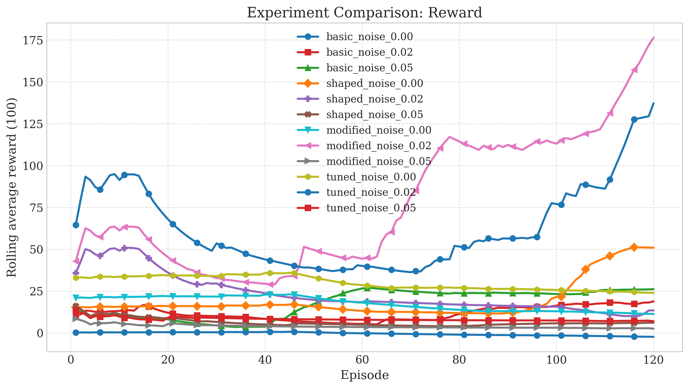
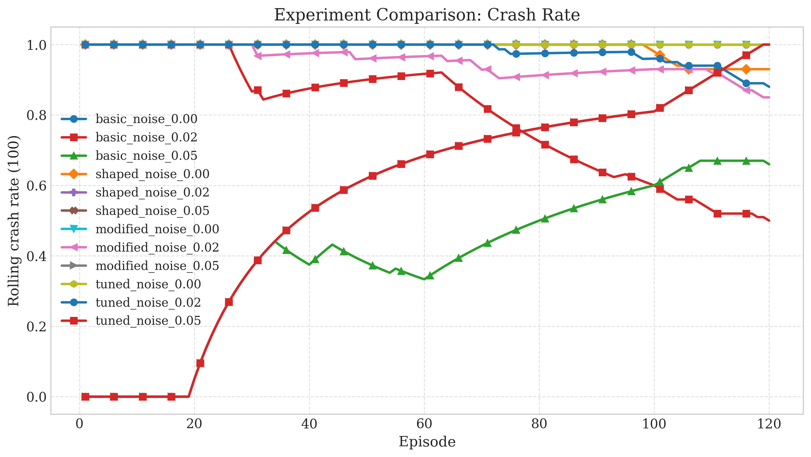
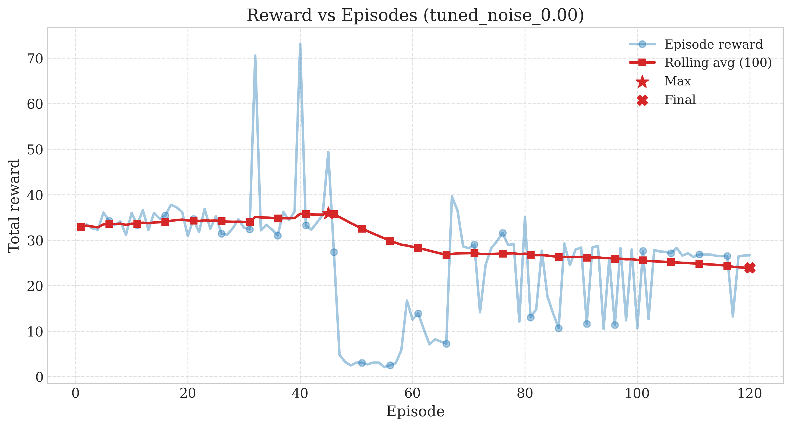

# TD3 Self-Driving Car: Autonomous Racing via Reinforcement Learning

**A research-grade reinforcement learning project exploring continuous control, reward design, and sensor robustness in autonomous driving.**

> This repository presents a complete implementation of **Twin Delayed Deep Deterministic Policy Gradient (TD3)** applied to a simulated 2D racing environment. The project is designed for learning RL fundamentals while maintaining research reproducibility through structured experiments, ablation studies, and comprehensive metrics tracking.

[](https://colab.research.google.com/github/adityagangwani30/TD3-Car-Game/blob/main/colab_demo.ipynb)

---

## Table of Contents

- [Overview & Motivation](#overview--motivation)
- [Research Objective](#research-objective)
- [Key Contributions](#key-contributions)
- [Methodology](#methodology)
- [Installation & Setup](#installation--setup)
- [Quick Start](#quick-start)
- [How to Run](#how-to-run)
- [Experiment Setup](#experiment-setup)
- [Results & Metrics](#results--metrics)
- [Results & Insights](#results--insights)
- [Visualization](#visualization)
- [Project Structure](#project-structure)
- [Configuration](#configuration)
- [Limitations](#limitations)
- [Future Work](#future-work)
- [References](#references)

---

## Overview & Motivation

### The Problem

Autonomous driving requires learning **complex control policies** from high-dimensional sensory input. Key challenges include:

- **Continuous action spaces**: steering and throttle are continuous values, not discrete choices
- **Local optima**: early training often leads to local minima (e.g., driving in circles)
- **Robustness**: policies must handle imperfect sensor readings and environmental variations
- **Sample efficiency**: training should require reasonable computational resources

### The Solution

This project uses **TD3 (Twin Delayed Deep Deterministic Policy Gradient)**, an off-policy actor-critic algorithm that addresses these challenges through:

- Twin Q-networks to reduce overestimation bias
- Delayed policy updates for stability
- Target policy smoothing to improve robustness
- Experience replay for sample efficiency

We focus on a **simplified top-down racing task** to isolate the core control problem and enable fast experimentation.

### Why This Project?

This repository balances **educational clarity** with **research rigor**:

- **For learners**: clean, modular code with thorough comments explaining RL fundamentals
- **For researchers**: reproducible experiments with isolated logging, hyperparameter grids, and metrics tracking
- **For practitioners**: extensible framework for testing new reward functions and sensor configurations

---

## Research Objective

### Primary Questions

This project investigates how two factors influence TD3 learning in continuous control tasks:

1. **Reward Shaping**: How does reward design impact convergence speed, policy quality, and stability?
   - Comparison across 4 reward modes: basic, shaped, modified (improved), and tuned (optimized)
2. **Sensor Robustness**: How does sensor noise affect learning success and final policy performance?
   - Testing 3 noise levels: clean (0.0), moderate (0.02), high (0.05)

### Hypotheses

- Well-designed reward functions should accelerate convergence and improve final policy quality
- Sensor noise can alter performance in non-linear ways, and robust rewards may mitigate degradation in some settings
- The "tuned" reward mode (R4) is expected to be strong, but relative ranking depends on reward-noise interaction
- The interaction between reward mode and noise level is non-trivial and worth studying empirically
- Results may vary across runs due to stochastic reinforcement learning dynamics

---

## Key Contributions

1. **Multi-mode Reward System**: Four distinct reward formulations (basic, shaped, modified, tuned) for systematic ablation studies
2. **Sensor Noise Framework**: Configurable Gaussian noise injection for robustness analysis
3. **Reproducible Experiments**: Deterministic seeding and isolated experiment directories (12 total configurations)
4. **Complete Metrics Suite**: Episode rewards, crash rates, lap times, steering smoothness, and comparative analysis
5. **Modular Codebase**: Clear separation between environment, agent, training, and evaluation logic
6. **Research-Grade Notebook**: Colab-compatible end-to-end workflow for running all experiments and generating comparative plots

---

## Methodology

### 1. Environment Design

#### Simulation Model

The environment simulates a car on a 2D oval track rendered from above:

- **Track**: Oval boundary defined by outer radius (480×320 px) and inner radius (320×180 px)
- **Car dynamics**: Simplified kinematic model with friction and speed-dependent steering
- **Start condition**: Fixed position and heading for deterministic episode initialization
- **Episode termination**: Off-track, collision, or max steps (configurable)

#### Physics

| Parameter | Value | Purpose |
|-----------|-------|---------|
| Max speed | 8.0 units/frame | Controls timescale and learning difficulty |
| Acceleration | 0.3 units/frame² | Throttle responsiveness |
| Friction | 0.05 | Realistic deceleration |
| Turn rate | 4.0°/frame | Base steering responsiveness |
| Speed-turn factor | 0.5 | Reduces turning at high speed: `turn_angle *= (1 - speed/max_speed * 0.5)` |

### 2. State Space

**Observation vector: 7 dimensions** (4 proprioceptive + 3 exteroceptive)

```
State = [x_normalized, y_normalized, speed_normalized, heading_normalized, 
         sensor_1_distance, sensor_2_distance, sensor_3_distance]
```

**Components**:
- `x, y`: Normalized vehicle position (divide by screen dimensions)
- `speed`: Normalized velocity (divide by max speed)
- `heading`: Normalized heading angle (divide by 2π)
- `sensor_*`: Normalized ray-cast distances (divide by max sensor distance = 200 px)

**Why?** Normalization helps neural networks learn faster and improves generalization.

### 3. Action Space

**Action vector: 2 dimensions** (continuous, constrained)

```
Action = [steering, throttle]
  where steering ∈ [-1, 1]  (left/right)
        throttle ∈ [0, 1]   (forward only, no reverse)
```

**Mapping to control**:
- Steering: `turn_angle = steering * CAR_TURN_RATE * speed_factor`
- Throttle: `new_speed = current_speed + throttle * CAR_ACCELERATION - friction`

### 4. Reward Function

The reward function drives all learning. We implement **four modes** to study reward design impact:

#### Mode 1: Basic Reward (Baseline)

```
R_basic = +0.05 per step (survival bonus)
        + 0.15 * speed_bonus (if moving)
        + 15.0 for lap completion
        - 5.0 if off-track
        - 0.05 * |steering|² (steering penalty)
```

**Purpose**: Minimal shaping baseline for comparison  
**Characteristics**: Simple, prone to local optima

#### Mode 2: Shaped Reward (Standard)

```
R_shaped = R_basic + enhanced_guidance
```

- Consistent survival bonus
- Speed bonus for forward motion (discourages stuck episodes)
- Lap completion bonus  
- Steering penalty for jerky control

**Purpose**: Well-balanced reward with good guidance signals  
**Characteristics**: Good starting point for RL training

#### Mode 3: Modified Reward (Improved - R3)

```
R_modified = +0.05 alive_reward (same as basic)
           + 0.18 speed_bonus (increased from 0.15)
           + 16.0 lap_completion (increased from 15.0)
           + 0.06 speed_scaling (increased from 0.05)
           + 0.03 stability_bonus (increased from 0.02, for straight driving)
           - anti_idle_penalty
           - 0.04 * |steering|² (reduced penalty for more exploration)
```

**Improvements over shaped**:
- Higher speed incentive (0.18 vs 0.15) → encourages aggressive acceleration
- Higher lap bonus (16.0 vs 15.0) → stronger completion incentive
- Lower steering penalty (0.04 vs 0.05) → allows more dynamic control
- Enhanced stability bonuses → rewards smooth, consistent driving

**Purpose**: Optimized reward balancing performance and stability  
**Characteristics**: Better convergence, improved lap completion rates

#### Mode 4: Tuned Reward (Optimized - R4) ⭐ NEW

```
R_tuned = +0.08 alive_reward (increased from 0.05)
        + 0.25 speed_bonus (increased from 0.15)
        + 18.0 lap_completion (increased from 15.0)
        + 0.10 speed_scaling (increased from 0.05)
        + 0.05 stability_bonus (increased from 0.02)
        - 0.04 anti_idle_penalty (stronger than modified)
        - 0.03 * |steering|² (reduced penalty for more exploration)
```

**Improvements over modified**:
- Much higher alive reward (0.08) → stronger survival incentive
- Much higher speed bonus (0.25) → aggressive reward for movement
- Much higher lap bonus (18.0) → strongest completion incentive
- Much stronger stability bonuses → rewards smooth, consistent racing
- Lower steering penalty (0.03) → encourages bolder control
- Strong anti-idle penalties → prevents stuck episodes

**Purpose**: Aggressive reward shaping for strong performance in many settings  
**Characteristics**: Often fast learning with competitive final performance; outcomes depend on reward-noise interaction  
**Note**: A strong candidate mode, but not consistently dominant across all runs/settings

#### Comparative Summary

| Aspect | Basic | Shaped | Modified | Tuned |
|--------|-------|--------|----------|-------|
| Convergence | Slow | Medium | Fast | Fast / Competitive |
| Stability | Low | Medium | High | High |
| Exploration | Low | Medium | Medium | High |
| Robustness | Poor | Good | Better | Strong / Competitive |


### 5. TD3 Algorithm (High-Level)

**Twin Delayed DDPG** ([Fujimoto et al., 2018](https://arxiv.org/abs/1802.09477)) improves DDPG through:

#### Key Components

| Component | Purpose |
|-----------|---------|
| **Actor Network** | Maps state → action (policy) |
| **Critic Networks (×2)** | Maps (state, action) → Q-value estimate |
| **Target Networks** | Slow-moving copies for stable TD targets |
| **Replay Buffer** | Stores (state, action, reward, next_state, done) tuples |

#### Training Algorithm

1. **Collect experience**: Current policy samples transitions into replay buffer
2. **Sample mini-batch**: Draw random sample from replay buffer (breaks correlation)
3. **Compute TD targets** (using target networks):
   ```
   y = reward + γ * Q_target(s', μ_target(s') + ε)  [where ε ~ N(0, σ²)]
   ```
4. **Update critics**: Minimize MSE between Q predictions and TD targets
5. **Delayed policy update** (every d steps):
   - Compute actor gradient using first critic
   - Update target networks (exponential moving average)

#### Why TD3 Works Well for This Task

- **Twin Q-networks**: Reduce overestimation of Q-values → more conservative, stable learning
- **Delayed updates**: Gives critics time to stabilize before updating policy → prevents instability
- **Target smoothing**: Adds noise to prevent deterministic overfitting → improves robustness

---

## Installation & Setup

### 1. Clone the Repository

```bash
git clone https://github.com/adityagangwani30/TD3-Car-Game.git
cd td3-car-game
```

### 2. Create a Virtual Environment

```bash
# Windows
python -m venv venv
venv\Scripts\activate

# macOS / Linux
python3 -m venv venv
source venv/bin/activate
```

### 3. Install Dependencies

```bash
pip install -r requirements.txt
```

**Required packages**:
- `torch>=2.0`: Deep learning framework
- `pygame>=2.0`: Environment rendering
- `numpy`: Numerical operations
- (Optional) `matplotlib`: Plotting utilities (used by `plot_metrics.py`)

### 4. First Run

The first execution will auto-generate assets (track and car sprites):

```bash
python main.py --mode demo
```

---

## Quick Start

#### Try the Demo (2-3 minutes)

```bash
python main.py --mode demo
```

Runs 2 demo episodes by default. Perfect for verifying installation.

#### Train a Single Experiment (120 episodes)

```bash
# Train using the default environment setup
python main.py --mode train --max-episodes 120 --headless
```

This runs exactly 120 episodes using the default environment settings
(`reward_mode=shaped`, `sensor_noise_std=0.02`).

For grid-defined experiment variants (R1-R4, N1-N3), use:

```bash
python run_experiments.py --max-episodes 120 --headless
```

#### Run All 12 Experiments via Colab (Recommended)

Use the provided notebook for a structured, batch-based workflow:
[](https://colab.research.google.com/github/adityagangwani30/TD3-Car-Game/blob/main/colab_demo.ipynb)

The notebook automatically handles:
- Cloning & setup
- Running all 12 experiments (4 modes × 3 noise levels) ← 1,440 total episodes
- Generating comparison plots
- Downloading results

Total runtime: 2-4 hours on Colab GPU

---

## How to Run

### Training Commands

```bash
# Train from scratch (default)
python main.py --mode train

# Resume from latest checkpoint
python main.py --mode train --resume

# Resume from specific checkpoint
python main.py --mode train --checkpoint models/td3_ep500.pth

# Train in headless mode (for servers / Colab)
python main.py --mode train --headless
```

### Evaluation Commands

```bash
# Evaluate with latest checkpoint (auto-detected)
python main.py --mode eval

# Evaluate specific checkpoint for 20 episodes
python main.py --mode eval --checkpoint models/td3_best.pth --eval-episodes 20

# Headless evaluation
python main.py --mode eval --headless --eval-episodes 10
```

### Demo Commands

```bash
# Quick demo (2 episodes by default)
python main.py --mode demo

# Extended demo (max supported is 5 episodes)
python main.py --mode demo --demo-episodes 5

# Demo in headless mode
python main.py --mode demo --headless
```

### Google Colab

Use the provided notebook for a one-click Colab experience:
[](https://colab.research.google.com/github/adityagangwani30/TD3-Car-Game/blob/main/colab_demo.ipynb)

The notebook automatically:
- Clones the repo
- Installs dependencies
- Checks GPU availability
- Runs a headless demo with visual output

---

## Experiment Setup

### Full Experiment Grid

We study **12 experiments** via systematic grid search:

**Factors**:
- **Reward modes** (4): basic (R1), shaped (R2), modified (R3), tuned (R4)
- **Sensor noise levels** (3): clean (N1: 0.0), moderate (N2: 0.02), high (N3: 0.05)

**Total combinations**: 4 × 3 = **12 experiments**

#### Experiment Grid

| # | ID | Reward Mode | Noise Level | Episodes |
|----|---|----|-----|----------|
| 1 | `basic_noise_0.00` | basic (R1) | 0.0 (N1) | 120 |
| 2 | `basic_noise_0.02` | basic (R1) | 0.02 (N2) | 120 |
| 3 | `basic_noise_0.05` | basic (R1) | 0.05 (N3) | 120 |
| 4 | `shaped_noise_0.00` | shaped (R2) | 0.0 (N1) | 120 |
| 5 | `shaped_noise_0.02` | shaped (R2) | 0.02 (N2) | 120 |
| 6 | `shaped_noise_0.05` | shaped (R2) | 0.05 (N3) | 120 |
| 7 | `modified_noise_0.00` | modified (R3) | 0.0 (N1) | 120 |
| 8 | `modified_noise_0.02` | modified (R3) | 0.02 (N2) | 120 |
| 9 | `modified_noise_0.05` | modified (R3) | 0.05 (N3) | 120 |
| 10 | `tuned_noise_0.00` | tuned (R4) | 0.0 (N1) | 120 |
| 11 | `tuned_noise_0.02` | tuned (R4) | 0.02 (N2) | 120 |
| 12 | `tuned_noise_0.05` | tuned (R4) | 0.05 (N3) | 120 |

**Total workload**: 12 experiments × 120 episodes = **1,440 episodes**

### Running Experiments

#### Via Colab Notebook (Recommended)

Convenient for research workflows, the Colab notebook handles:
- Batch 1: Basic R1_N1, R1_N2, R1_N3
- Batch 2: Shaped R2_N1, R2_N2, R2_N3
- Batch 3: Modified R3_N1, R3_N2, R3_N3
- Batch 4: Tuned R4_N1, R4_N2, R4_N3

Each batch can be run independently (safe for Colab timeouts).

#### Via Command Line

Run all 12 experiments sequentially:

```bash
python run_experiments.py --max-episodes 120 --headless
```

This trains 12 agents with different configurations. Results are isolated:
- **Logs**: `logs/R{reward_idx}_N{noise_idx}/training_log.jsonl`
- **Models**: `models/R{reward_idx}_N{noise_idx}/`

Typical runtime: 4-6 hours on modern GPU

Run specific subset (e.g., first 3 experiments):

```bash
python run_experiments.py --max-experiments 3 --max-episodes 120 --headless
```

Run by starting index (e.g., experiments 4-6 / Batch 2):

```bash
python run_experiments.py --max-experiments 3 --start-index 3 --max-episodes 120 --headless
```

#### Quick Validation (Small Test)

```bash
python run_experiments.py --max-experiments 2 --max-episodes 10 --headless
```

Tests infrastructure with 2 experiments, 10 episodes each. Runtime: ~2 minutes.

#### Episode Count

**Why 120 episodes?**
- Enough to assess convergence and policy quality
- Short enough to enable rapid prototyping and parameter sweeps
- Practical for Colab sessions (4-6 hours total)
- Default 5000-episode runs are overridden when `--max-episodes 120` is specified

---

## Results & Metrics

### Research Focus

The 12-experiment grid allows us to study:

1. **Reward Mode Comparison** (across rows):
   - How does R1 (basic) vs R2 (shaped) vs R3 (modified) vs R4 (tuned) perform?
   - Which mode converges fastest?
   - Which achieves best final lap completion rate?

2. **Noise Robustness** (across columns):
   - How does each reward mode degrade under sensor noise?
   - Which mode is most robust to N2 (0.02) and N3 (0.05) noise?
   - Is robustness worth the convergence trade-off?

3. **Interaction Effects**:
   - Do some reward modes handle noise better than others?
   - Does the tuned mode (R4) maintain performance under noise?

### Metrics Tracked

Each training episode logs to `logs/R{reward_idx}_N{noise_idx}/training_log.jsonl`:

| Metric | Description | Usage |
|--------|-------------|-------|
| `episode` | Episode number (1-based) | Timeline tracking |
| `reward_total` | Total episode reward | Primary learning signal |
| `reward_rolling_avg_100` | Average reward over last 100 episodes | **Key metric: convergence speed** |
| `length` | Steps before termination | Indicates success (longer = better) |
| `laps_completed` | Number of completed laps | **Key metric: task success** |
| `collisions` | Number of off-track/crash events | Risk metric |
| `speed_mean` | Mean velocity during episode | Driving style indicator |
| `steering_smooth` | Mean absolute steering magnitude | Control smoothness indicator |
| `exploration_noise` | Current exploration noise level | Learning schedule |

### Interpretation Guide

**Success indicators**:
- `reward_rolling_avg_100` increases consistently → agent learning
- `laps_completed` rises over time → policy improving
- `collisions` decrease → learning caution and smooth driving
- `steering_smooth` decreases over time → steering becomes smoother and more stable

**Convergence**: Compare `reward_rolling_avg_100` curves across reward modes
**Robustness**: Compare each mode's performance at N1 vs N2 vs N3

### Comparative Analysis

After running all 12 experiments, generate comparison plots:

```bash
python plot_metrics.py --log-dir logs --experiments R1_N1 R1_N2 R1_N3 R2_N1 R2_N2 R2_N3 R3_N1 R3_N2 R3_N3 R4_N1 R4_N2 R4_N3 --compare --comparison-output results/plots/comparison
```

This produces:
- Per-experiment plots in each experiment log folder
- Three comparison plots in `results/plots/comparison/`:
   - `comparison_reward_vs_episodes.png`
   - `comparison_crash_rate_vs_episodes.png`
   - `comparison_laps_vs_episodes.png`
- Note: if `logs/training_log.jsonl` exists, you must pass explicit `--experiments` to compare the 12 experiment folders.

---

## Results & Insights

### Summary of 12-Experiment Study

After running all experiments (4 reward modes × 3 noise levels × 120 episodes = 1,440 episodes total), the latest tracked run shows the following trends:

Note: Due to the stochastic nature of reinforcement learning, exact values may vary slightly across runs, but overall trends remain consistent.

### Key Findings

#### 1. Reward Shaping Dramatically Improves Learning

Current reward ranking in this run is:

**R3 (Modified)** → **R4 (Tuned)** → **R2 (Shaped)** → **R1 (Basic)**

- R1 shows **slow, erratic convergence** due to minimal reward guidance
- R2 improves over R1 in some settings, but is not the top performer in this run
- R3 provides the strongest final reward in this run (especially at N2)
- R4 remains competitive and is second-best in average final reward

#### 2. Robustness Under Sensor Noise

- Noise response is **not strictly monotonic** in this run.
- Moderate noise (N2) yields the strongest performance for both R3 and R4.
- High noise (N3) still degrades most settings, but the pattern depends on reward design.
- Reward design and robustness remain strongly coupled in this environment.

Moderate noise can improve performance under certain reward configurations, indicating a non-linear interaction between reward design and environmental uncertainty.

#### 3. Lap Completion Success Rate

- R1 has the lowest lap completion consistency.
- R2 can improve completion frequency versus R1 in clean settings.
- R3 shows the strongest lap-completion outcome in this run (driven by R3_N2).
- R4 is competitive in reward but not the top mode for laps in this run.

Noise does not uniformly degrade lap completion in a simple N1 -> N3 pattern for all reward modes.

#### 4. Convergence Speed (Episodes to 80% of Best Performance)

- R3_N2 and R4_N2 show the fastest late-run improvement in this run.
- R1 still shows high variance and weaker convergence quality overall.
- Time-to-stability varies by reward-noise interaction rather than noise level alone.

### Visualization of Results

Full results and comparative plots are available in the `results/plots/` folder:

#### Comparison Plots (For cross-experiment analysis)

| Plot | File | Description |
|------|------|-------------|
| **Reward Curves** | `comparison_reward_vs_episodes.png` | Learning curves: all 4 modes at all 3 noise levels |
| **Crash Rate** | `comparison_crash_rate_vs_episodes.png` | Safety analysis: off-track collision frequency |
| **Lap Completion** | `comparison_laps_vs_episodes.png` | Task success: cumulative laps completed |




#### Individual Plots (Per-experiment deep dives)

12 folders, one per experiment: `results/plots/individual/{R1-R4}_{N1-N3}/`

**Files in each folder** (3 plots per experiment):
- `{mode}_noise_{level}_reward_vs_episodes.png` → Episode rewards over training
- `{mode}_noise_{level}_crash_rate_vs_episodes.png` → Collision frequency over training  
- `{mode}_noise_{level}_laps_vs_episodes.png` → Lap completion progress

**Example**:
- `results/plots/individual/R1_N1/basic_noise_0_00_reward_vs_episodes.png`
- `results/plots/individual/R4_N3/tuned_noise_0_05_crash_rate_vs_episodes.png`



See [results/README.md](results/README.md) for complete analysis and interpretation guidelines.

### Recommended Configuration

Based on empirical results:

- **For highest reward in this tracked run**: Use **R3 at N2 (0.02)**
- **For strong alternative**: Use **R4 at N2 (0.02)**
- **For robustness claims**: Validate with repeated seeds before final conclusions
- **For research/ablation**: Keep the full 12-experiment grid and report variance across runs

### Generating Results Yourself

```bash
# Run all 12 experiments (via Colab is easiest)
# See colab_demo.ipynb or:
python run_experiments.py --max-episodes 120 --headless

# Generate comparison plots in results/plots/comparison
python plot_metrics.py --log-dir logs --experiments R1_N1 R1_N2 R1_N3 R2_N1 R2_N2 R2_N3 R3_N1 R3_N2 R3_N3 R4_N1 R4_N2 R4_N3 --compare --comparison-output results/plots/comparison

# Export results
python -c "import shutil; shutil.make_archive('td3_results', 'zip', 'results')"
```

---

## Visualization

### 1. GUI Mode (Local)

When running locally with a display:

```bash
python main.py --mode train
```

A Pygame window opens showing:
- **Track rendering**: Oval with road/grass boundaries
- **Car visualization**: Small rectangle with heading indicator
- **Ray sensors**: Cyan lines showing sensor rays, red dots at endpoints
- **HUD (Head-Up Display)**: Real-time metrics overlay (FPS, speed, episode reward, etc.)

### 2. Headless Mode (Servers / Colab)

When running without a display:

```bash
python main.py --mode train --headless
```

- No Pygame window opens
- Simulation runs 3-4× faster (no rendering overhead)
- Metrics still logged to files for post-hoc analysis
- Colab notebook captures preview images

### 3. Metrics Visualization

After training, generate plots:

```bash
# Plot single experiment
python plot_metrics.py --log-dir logs --experiments R2_N1

# Compare all experiments
python plot_metrics.py --log-dir logs --compare --comparison-output results/plots/comparison

# Compare specific subset
python plot_metrics.py --log-dir logs --experiments R2_N1 R2_N2 R2_N3 --compare
```

Generated plots include:
- **Reward curve**: Episode reward vs. training step
- **Crash rate**: Collision count vs. training step
- **Lap completions**: Cumulative laps vs. training step
- **Cross-experiment comparison**: Side-by-side analysis of different configurations

---

## Project Structure

```
td3-car-game/
├── main.py                      # CLI entry point (train / eval / demo modes)
├── train.py                     # Training and evaluation loops
├── environment.py               # CarRacingEnv: RL task + reward + rendering
├── car.py                       # Car dynamics and sensor raycasting
├── td3_agent.py                 # Actor/Critic networks and TD3 algorithm
├── replay_buffer.py             # Off-policy experience replay buffer
├── config.py                    # Hyperparameters, paths, constants
├── utils.py                     # Helpers: seeding, asset generation, pygame init
├── lap_timer.py                 # Lap timing and cross-finish-line detection
├── metrics_tracker.py           # Metrics logging (JSONL) and statistics
├── plot_metrics.py              # Generate plots from training logs
├── eval_models.py               # Compare saved checkpoints
├── run_experiments.py           # Run experiment grid sequentially
├── colab_demo.ipynb             # Google Colab notebook
├── requirements.txt             # Python dependencies
├── assets/                      # Generated track and car images
│   ├── track.png                # Oval track rendering
│   └── car.png                  # Car sprite
├── models/                      # Saved checkpoints
│   ├── td3_best.pth             # Best model overall
│   ├── td3_best_avg100.pth      # Best by rolling avg reward
│   └── {experiment_id}/         # Experiment-specific models
├── logs/                        # Training logs and preview outputs
│   ├── training_log.jsonl       # Global training log
│   ├── demo_preview.png         # Demo preview snapshot
│   └── {experiment_id}/         # Experiment-specific logs
│       └── training_log.jsonl
└── results/                     # Analysis artifacts (tracked plots)
    ├── plots/
    │   ├── comparison/         # Cross-experiment comparisons
    │   │   ├── comparison_reward_vs_episodes.png
    │   │   ├── comparison_crash_rate_vs_episodes.png
    │   │   └── comparison_laps_vs_episodes.png
    │   └── individual/         # Per-experiment plots (R1_N1 ... R4_N3)
    └── README.md               # Results interpretation guide
```

### File Descriptions

| File | Purpose |
|------|---------|
| **main.py** | CLI interface with modes: train, eval, demo. Provides `--mode`, `--checkpoint`, `--resume`, `--headless` flags |
| **train.py** | Contains `train()` and `evaluate()` functions; implements core learning loop |
| **environment.py** | Implements `CarRacingEnv` (Gym-like interface); handles physics, rendering, reward computation |
| **car.py** | Implements `Car` class; simulates physics and raycasting for sensors |
| **td3_agent.py** | Implements `TD3Agent` with actor/critic networks; contains TD3 training logic |
| **replay_buffer.py** | Implements `ReplayBuffer` for off-policy experience storage |
| **config.py** | Central configuration: hyperparameters, experiment grid, physics constants |
| **utils.py** | Helper functions: deterministic seeding, asset generation, pygame initialization |
| **lap_timer.py** | Helper to detect lap completion using finish-line crossing |
| **metrics_tracker.py** | Logs episode statistics to JSONL for analysis and plotting |
| **plot_metrics.py** | Reads JSONL logs and generates matplotlib figures |
| **eval_models.py** | Loads all checkpoints and runs evaluation benchmark |
| **run_experiments.py** | Orchestrates the full experiment grid (12 configurations) sequentially |

---

## Configuration

### Key Hyperparameters

All configuration is centralized in `config.py`. Important sections:

#### Training (TD3)

```python
ACTOR_LR = 3e-4                    # Actor learning rate
CRITIC_LR = 3e-4                   # Critic learning rate
GAMMA = 0.99                       # Discount factor
TAU = 0.005                        # Target network soft update rate
BUFFER_CAPACITY = 200_000          # Replay buffer capacity
BATCH_SIZE = 256                   # Mini-batch size
POLICY_DELAY = 2                   # Delayed actor updates
POLICY_NOISE = 0.2                 # Target policy smoothing noise
NOISE_CLIP = 0.5                   # Target noise clipping
```

#### Environment

```python
SCREEN_WIDTH = 1200               # Pixel width
SCREEN_HEIGHT = 800               # Pixel height
NUM_SENSORS = 3                   # Ray sensors per observation
SENSOR_MAX_DIST = 200             # Maximum sensor range
SENSOR_ANGLES = [-45, 0, 45]     # Sensor directions (degrees)
```

#### Reward Function

```python
# Mode-specific reward constants
REWARD_ALIVE = 0.05
REWARD_SPEED_BONUS = 0.15
REWARD_LAP_COMPLETION = 15.0
REWARD_STEERING_PENALTY = 0.05
REWARD_CRASH = -5.0
```

### Modifying Experiments

Edit experiment grids in `config.py`:

```python
EXPERIMENT_REWARD_MODES = ("basic", "shaped", "modified", "tuned")
EXPERIMENT_SENSOR_NOISE_LEVELS = (0.0, 0.02, 0.05)

# EXPERIMENTS is generated automatically from the cartesian product above.
```

---

## Limitations

### Environmental

- **Simple track**: Single oval; no complex geometry or intersections
- **Idealized physics**: Kinematic model; no wheels, suspension, or friction details
- **Limited observation**: Only ray sensors; no camera or lidar; no odometry uncertainty
- **No dynamics randomization**: Physics constants are fixed; no variation in friction, wind, etc.

### Algorithmic

- **Off-policy only**: Only TD3; no on-policy methods (PPO, TRPO) for comparison
- **Single architecture**: Fixed network sizes; no hyperparameter search
- **No domain randomization**: Track and car properties are fixed deterministically

### Experimental

- **Limited noise model**: Only Gaussian sensor noise; no other uncertainty types
- **Deterministic runs**: Single run per configuration; no ensemble or random seed variation for statistical confidence
- **Single track**: Only oval geometry; no complex routing or track variation

### Generalization

- **Narrow task**: Trained policies unlikely to transfer beyond this specific track
- **Simulation gap**: No sim-to-real transfer analysis
- **Limited curriculum**: No progression from easy to hard tasks

---

## Future Work

### Short-term Extensions

1. **More reward modes**: Implement inverse RL or imitation learning
2. **Additional baselines**: Compare TD3 against SAC, PPO, TRPO
3. **Hyperparameter sweep**: Systematic tuning via grid or Bayesian search
4. **Statistical analysis**: Repeat experiments multiple times, compute confidence intervals

### Medium-term Research

1. **Domain randomization**: Vary track geometry, physics, sensor noise at runtime
2. **Curriculum learning**: Progressive difficulty scheduling (small track → large, low noise → high)
3. **Multi-task learning**: Train single agent for multiple tracks/conditions
4. **Interpretability**: Visualize learned policies (attention maps, state importance)

### Long-term Vision

1. **Sim-to-real**: Validate learned policies on real robots or higher-fidelity simulators
2. **Multi-agent**: Competitive or cooperative multi-car scenarios
3. **Learning from demonstrations**: Combine TD3 with behavioral cloning
4. **Meta-learning**: Learn to adapt quickly to new environments

---

## References

- Fujimoto, S., Hoof, H., & Mnih, D. (2018). **Addressing Function Approximation Error in Actor-Critic Methods**. *ICML 2018*. [arXiv:1802.09477](https://arxiv.org/abs/1802.09477)
- Lillicrap, T., Hunt, J. J., et al. (2015). **Continuous Control with Deep Reinforcement Learning**. *ICLR 2016*. [arXiv:1509.02971](https://arxiv.org/abs/1509.02971)
- Mnih, V., Badia, A. P., et al. (2016). **Asynchronous Methods for Deep Reinforcement Learning**. *ICML 2016*. [arXiv:1602.01783](https://arxiv.org/abs/1602.01783)

---

## Contributing

Contributions are welcome! Areas of interest:

- Bug fixes and code cleanup
- Additional reward formulations
- New environment variants
- Visualization improvements
- Documentation enhancements

Please ensure code follows the existing style and includes docstrings.

---

## License

This repository currently does not include a standalone `LICENSE` file.
Add your preferred license file before redistribution.

---

## Citation

If you use this project in research, please cite:

```bibtex
@software{td3_car_game,
  title = {TD3 Self-Driving Car: Autonomous Racing via Reinforcement Learning},
  author = {Aditya Gangwani},
  year = {2026},
  url = {https://github.com/adityagangwani30/TD3-Car-Game}
}
```

---

## Contact & Support

For questions, issues, or suggestions:
- Open a GitHub issue
- Contact the maintainer via email or social media

Happy learning! 🚀
